# アーキテクチャ設計書

## コンポーネント図

## シーケンス図

## 機能概要

| コンポーネント名 | 機能概要 |
| --- | --- |
| COVER | フタの開閉状態を検出する |
| NW | ネットワーク経由で、ユーザに曲の選択をさせる |
| SYSCTL | ①フタ開閉フラグから制御状態を生成する。②選択曲インデックスを外部に公開する。 |
| SCORE | 再生する曲の選択を行う |
| SOUND | 選択された曲を実際に再生する |
| OLED | 曲の情報や、全体のうち何秒再生したかを表示する |

## IF一覧

| 信号名 | IF名 |
| --- | --- |
| COVER_フタ開放フラグ | COVER_GetOpenedFlag |
| NW_選択曲インデックス | NW_GetSelectedScoreIdx |
